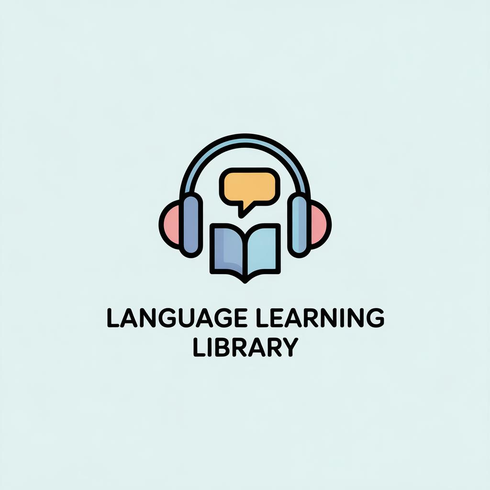
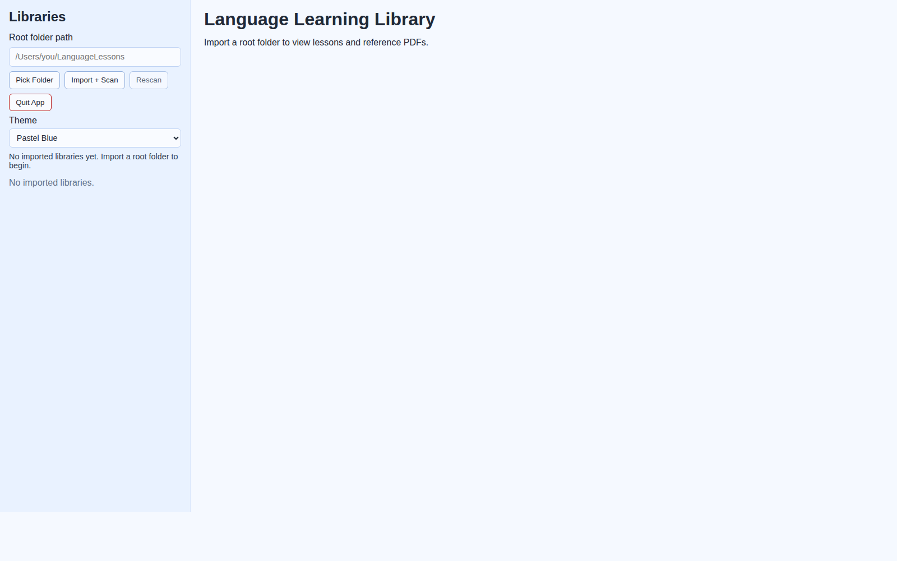
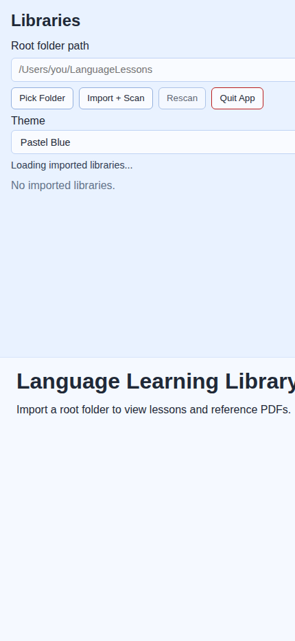

# Language Learning Library



Offline-first desktop app for browsing language lessons (audio) and reference materials (PDF) from local folders.

## Current Status

Implemented through Phases 1-10:

- Full offline Tauri desktop app with React + TypeScript UI
- Recursive folder import/scan for audio + PDFs
- SQLite persistence for libraries, lessons, PDFs, folder tree, played state, last lesson, playback position
- Lesson browser UI with folder tree and progress indicators
- Audio playback with icon controls (play/pause, stop, rewind, fast-forward), seek bar, time display, previous/next, auto-advance
- In-app PDF viewing and fallback open
- Draggable divider between lesson pane and PDF pane
- Quit button for graceful app exit
- Theme system with pastel presets and local persistence

## Screenshots

### Desktop



### Mobile/Narrow Layout



## Tech Stack

- Frontend: React 18 + TypeScript + Vite
- Desktop shell: Tauri 2
- Backend: Rust
- Database: SQLite via `rusqlite` (`bundled` feature)
- Dialogs: `@tauri-apps/plugin-dialog`

## Supported Media

- Audio: `mp3`, `m4a`, `wav`, `aac`, `flac`, `ogg`
- Documents: `pdf`

## PDF Behavior

- Root-level PDFs in an imported library are treated as shared documents and remain available across folder/lesson navigation.
- PDFs in the same folder as lessons are treated as folder-local references.
- Libraries with audio-only, PDF-only, mixed structures, or no PDFs are handled.

## Project Structure

```text
Language-Learning-Library/
  src/
    App.tsx
    main.tsx
    styles.css
    components/
      AppShell.tsx
      FolderTree.tsx
    lib/
      library-utils.ts
      tauri-api.ts
    types/
      library.ts
  src-tauri/
    Cargo.toml
    tauri.conf.json
    capabilities/
      default.json
    src/
      main.rs
      database.rs
      repository.rs
      scanner.rs
      models.rs
```

## Prerequisites

Required on all platforms:

- Node.js 20+ and npm
- Rust toolchain (stable) via `rustup`
- Tauri system dependencies (platform-specific below)

Install Rust:

```bash
curl --proto '=https' --tlsv1.2 -sSf https://sh.rustup.rs | sh
```

Verify tools:

```bash
node -v
npm -v
rustc -V
cargo -V
```

## Platform Dependencies

### Linux

Ubuntu/Debian:

```bash
sudo apt update
sudo apt install -y \
  build-essential pkg-config curl wget file \
  libgtk-3-dev libwebkit2gtk-4.1-dev libsoup-3.0-dev \
  libayatana-appindicator3-dev librsvg2-dev patchelf
```

Fedora:

```bash
sudo dnf install -y \
  gcc gcc-c++ make pkgconfig curl wget file \
  gtk3-devel webkit2gtk4.1-devel libsoup3-devel \
  libappindicator-gtk3-devel librsvg2-devel
```

Arch:

```bash
sudo pacman -S --needed \
  base-devel pkgconf curl wget file \
  gtk3 webkit2gtk-4.1 libsoup3 libappindicator-gtk3 librsvg
```

### Windows

- Install Microsoft Visual Studio 2022 Build Tools with:
  - Desktop development with C++
  - Windows 10/11 SDK
- Install WebView2 runtime (usually preinstalled on Windows 11; otherwise install Evergreen runtime).
- Install Rust via `rustup-init.exe`.
- Install Node.js 20+.

Optional check in PowerShell:

```powershell
node -v
npm -v
rustc -V
cargo -V
```

### macOS

```bash
xcode-select --install
brew install node
curl --proto '=https' --tlsv1.2 -sSf https://sh.rustup.rs | sh
```

Notes:

- WebKit is provided by macOS.
- Ensure Xcode Command Line Tools are installed.

## Setup

From project root:

```bash
npm install
```

## Run In Development

```bash
npm run tauri:dev
```

## Build

Frontend typecheck + build:

```bash
npm run build
```

Desktop app bundle:

```bash
npm run tauri:build
```

Linux package outputs (no spaces in filenames):

- `src-tauri/target/release/bundle/deb/language-learning-library_0.1.0_amd64.deb`
- `src-tauri/target/release/bundle/rpm/language-learning-library-0.1.0-1.x86_64.rpm`

Install on Debian/Ubuntu:

```bash
sudo apt install "./src-tauri/target/release/bundle/deb/language-learning-library_0.1.0_amd64.deb"
```

## Troubleshooting

- `cargo metadata ... No such file or directory (os error 2)`:
  - `cargo` is not installed or not on `PATH`; install Rust and restart shell.
- `javascriptcoregtk-4.1.pc not found` on Linux:
  - Install Linux WebKitGTK dependencies (`libwebkit2gtk-4.1-dev` / equivalent).
- `.deb` install reports unsatisfied GTK dependencies on Ubuntu 24+:
  - Ensure `libgtk-3-0t64` and `libwebkit2gtk-4.1-0` are installed.
  - Example: `sudo apt install libgtk-3-0t64 libwebkit2gtk-4.1-0`
- AppImage bundles are currently disabled by default in this project:
  - Linux outputs focus on `.deb` and `.rpm`, which have been validated here.
- `Failed to load libraries: ... invoke`:
  - Launch with `npm run tauri:dev` (not plain `npm run dev`) so Tauri backend is available.
- Quit button permission errors:
  - Ensure `src-tauri/capabilities/default.json` includes `core:window:allow-close`.

## Data + Privacy

- Local-only app, no server.
- Library metadata and state stored in local SQLite DB inside Tauri app data directory.

## Additional Documentation

- See `PROJECT_HISTORY.md` for the full phase-by-phase implementation record and feature timeline.
